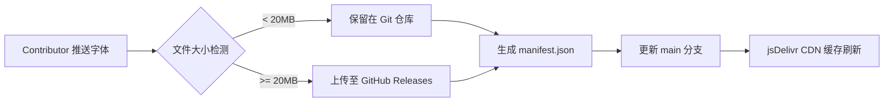

# ⚡ Better Fonts Market

> **为 [FontLens](https://github.com/leekitleung/utools-font-preview) 打造的开放、免费、可商用云端字体源。**

Better Fonts Market 是一个社区驱动的开源字体仓库。我们致力于收集全网优质的免费商用字体，并通过自动化流程生成配置源，让 uTools 用户能够一键预览并使用这些字体。

## ✨ 特性

- **💯 100% 免费商用**：严选 OFL、Apache 2.0、MIT 或明确声明免费商用的字体，下载即用，无版权后顾之忧。
- **🚀 全球 CDN 加速**：小文件通过 jsDelivr 全球分发，预览秒开；大文件自动托管至 GitHub Releases。
- **🤖 自动化构建**：提交 PR 合并后，GitHub Actions 自动更新 `manifest.json`，用户端即刻生效。

## 📦 如何使用

1. 打开 uTools **FontLens (字见)** 插件。
2. 进入 **设置 -> 云端字体源**。
3. 添加以下源信息：

| 字段 | 内容 |
| :--- | :--- |
| **名称** | Better Fonts Market (或任意名称) |
| **地址** | `https://cdn.jsdelivr.net/gh/leekitleung/better-fonts-market@main/manifest.json` |

添加成功后，点击刷新即可获取最新字体列表。

## 📚 收录字体预览 (部分)

> 完整列表请查看 [manifest.json](./manifest.json)

| 字体名称 | 格式 | 大小 | 许可证 | 风格 |
| :--- | :--- | :--- | :--- | :--- |
| **Nishiki-teki** | TTF | 9.7 MB | MIT | 手写 / 马克笔 |
| **优设鲨鱼菲特健康体** | TTF | 3.3 MB | 优设授权 | 标题 / 粗体 |
| **汇文明朝体** | OTF | 24.4 MB | OFL | 宋体 / 印刷 |
| **猫啃什锦黑** | TTF | 10.5 MB | OFL | 黑体 / 可爱 |
| **霞鹜文楷** | TTF | 5.2 MB | OFL | 楷体 / 屏幕阅读 |
| ... | ... | ... | ... | ... |

## 🤝 如何贡献 (Contributing)

我们非常欢迎社区提交新的字体！为了保证用户端的良好展示，请务必遵守以下规范。

### 1. 提交流程

1. **Fork** 本仓库到你的 GitHub 账号。
2. 在根目录创建一个**新文件夹**（见下方命名规范）。
3. 将字体文件（`.ttf`, `.otf` 等）放入该文件夹。
4. (可选) 放入 `LICENSE` 文本文件或版权说明截图。
5. 提交 **Pull Request**，描述中注明：字体来源链接、作者、授权协议。

### 2. 命名规范 (重要 ⚠️)

为了避免在插件中显示乱码或冗余标签（如 `[MianFei]`），请严格遵守：

- **文件夹命名**：必须使用**纯英文/拼音**，不包含空格或特殊字符。
  - ✅ 推荐：`SmileySans` / `XiaWuWenKai`
  - ❌ 禁止：`[免费]得意黑` / `站酷 快乐体`
- **字体文件**：建议保持原始文件名，或重命名为英文。

### 3. 提交要求

- **必须商用免费**：不接受仅限个人使用或需付费授权的字体。
- **格式支持**：`.ttf` / `.otf` / `.ttc` / `.woff` / `.woff2`。
- **单一原则**：一个文件夹只存放一个字体家族（及其不同字重）。

## ⚙️ 技术架构

本仓库采用 GitHub Actions 实现全自动化的字体发布流水线：

* **Manifest 生成**：通过 `scripts/generate-manifest.ps1` 扫描目录，自动提取元数据（文件名、大小、哈希值）。
* **分发策略**：利用 jsDelivr 对 GitHub 的原生支持实现 CDN 加速；超大字体文件自动分离存储，避免仓库体积膨胀。

## 📄 免责声明

本仓库仅作为字体文件的索引和托管平台。所有字体的版权归原作者所有，仓库内会尽可能附带原版授权文件。虽然我们会严格审核提交的字体授权，但在商业使用前，建议您再次核实具体的授权条款。

---

Made with ❤️ for uTools Community

